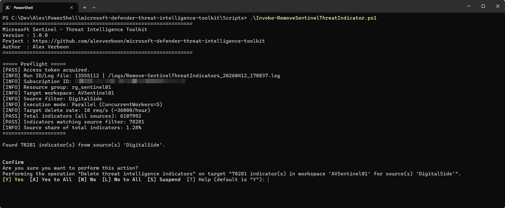

# Microsoft Defender Threat Intelligence Toolkit

A community PowerShell toolkit for managing **Microsoft Sentinel Threat Intelligence indicators**.

---

## Overview

This repository provides scripts to bulk-delete threat intelligence (TI) indicators from a Microsoft Sentinel workspace. It is designed for security engineers and SOC teams who need to clean up stale or unwanted indicators at scale.

### The problem: indicator bloat

Over time, a Microsoft Sentinel workspace can accumulate a very large number of threat intelligence indicators. A common cause is automated threat feed ingestion — feeds such as ThreatView, MDTI, or other third-party sources push indicators into Sentinel on a schedule. Each import cycle adds new indicators, and unless old ones are actively expired or deleted, the total count grows unbounded.

The screenshot below shows an example workspace with over **6.3 million indicators**:


At this scale, indicator management through the portal becomes impractical. Searches are slow, filtering is cumbersome, and there is no built-in bulk delete capability for large volumes.

### Identifying the source

To understand which feeds are responsible for the high volume, use the **Source** filter in the Microsoft Defender portal under **Intel management**. Filtering by source lets you quickly see how many indicators each feed has contributed:


In the example above, filtering by `ThreatViewURLBlockList` and `ThreatViewIPBlockList` reveals nearly **967,000 indicators** from those two sources alone. Once you know the source name, you have everything needed to target a bulk delete.

### Impact on Log Analytics costs

A high indicator count does not only affect portal usability — it also directly drives up the size of the `ThreatIntelIndicators` and `ThreatIntelObjects` tables in Log Analytics, which contributes to ingestion and retention costs.

The screenshot below (from the Microsoft Sentinel workspace workbook) shows how the TI-related tables contribute to overall data volume:


To quantify the cost contribution per feed source, run the following KQL query in your Log Analytics workspace:

```kql
ThreatIntelIndicators
| where TimeGenerated > ago(360d)
| where _IsBillable == true
| summarize 
    TotalVolumeGBLog = round(sum(_BilledSize / 1024 / 1024 / 1024), 2),
    Count = count() 
    by SourceSystem
    //| summarize round((sum(TotalVolumeGBLog)),2)
```

This returns the billed volume in GB and indicator count broken down by source — making it straightforward to identify which feeds are the largest cost contributors and prioritise which ones to clean up first.

### Cleaning up with this script

With the source name identified, set `$SourceFilter` in `Invoke-RemoveSentinelThreatIndicator.ps1` to one or more source values and run the script. It will count all matching indicators, prompt for confirmation, then delete them in batches — handling pagination, token refresh, and rate limiting automatically.

The screenshot below shows the indicator delete progress view used during bulk cleanup runs:



---

## Scripts

| Script | Description |
|--------|-------------|
| `Scripts\Common\Toolkit.Logging.ps1` | Shared logging helpers (`Initialize-ToolkitLogger`, `Write-Log`) for reuse across scripts. |
| `Scripts\Remove-SentinelThreatIndicators.ps1` | Contains the `Remove-SentinelThreatIndicators` function. Dot-source this file to load the function. |
| `Scripts\Invoke-RemoveSentinelThreatIndicator.ps1` | Caller script. Edit the configuration block at the top and run this file. |

---

## Prerequisites

| Requirement | Details |
|-------------|---------|
| PowerShell | 7.0 or later (required). |
| Az.Accounts module | `Install-Module Az.Accounts` |
| Azure RBAC | **Microsoft Sentinel Contributor** (or equivalent) on the target workspace. |

---

## Quick Start

1. **Get the repository locally** (recommended):

    ```powershell
    git clone https://github.com/alexverboon/microsoft-defender-threat-intelligence-toolkit.git
    cd microsoft-defender-threat-intelligence-toolkit
    ```

    If you prefer, you can also download the repository ZIP from GitHub and extract it.

2. **Install the required module** (if not already installed):

   ```powershell
   Install-Module Az.Accounts -Scope CurrentUser
   ```

3. **Sign in to Azure:**

   ```powershell
   Connect-AzAccount
   ```

### Bulk Indicator Removal

1. **Edit the configuration** in `Invoke-RemoveSentinelThreatIndicator.ps1`:

   ```powershell
    $SubscriptionId    = "<subscription-guid>"       # Required: Azure subscription GUID containing the Sentinel workspace
    $ResourceGroupName = "<resource-group-name>"     # Required: Azure resource group name containing the workspace
    $WorkspaceName     = "<workspace-name>"          # Required: Log Analytics workspace name linked to Sentinel
    $BatchSize         = 100                          # Integer > 0; lower values reduce burst pressure
    $SourceFilter      = @("<source-name>")          # One or more source names; use @() for ALL sources
    $ConcurrentWorkers = 5                            # Integer >= 1; used on PowerShell 7+ for parallel delete workers
    $TargetDeleteRatePerSecond = 10.0                # Decimal > 0; sustained delete rate across all workers
    $ShowAPIWarnings = $false                        # $true = print per-request API diagnostics
    $Confirm           = $true                        # $true = confirmation prompt; set $false for unattended runs
    $WhatIf            = $false                       # $true = simulate without deleting indicators
    $LogFile           = ""                          # Optional full file path; leave "" for default (script folder\Logs)
   ```

2. **Run the caller script:**

   ```powershell
    .\Scripts\Invoke-RemoveSentinelThreatIndicator.ps1
   ```

---

## Logging

The toolkit writes structured logfmt output for each run. Logs include run-level correlation (`run_id`), event names, progress, and warning/error context.

- Format reference: https://brandur.org/logfmt
- Default location for the current cleanup script: `<script folder>\Logs\Remove-SentinelThreatIndicators_<yyyyMMdd_HHmmss>.log`
- Full logging reference: [docs/logging.md](docs/logging.md)

---

## Notes

- The script uses the **Microsoft Sentinel / SecurityInsights REST API** directly, via `Invoke-RestMethod`.
- Token refresh is handled automatically on `401 Unauthorized` responses.
- Rate limiting (`429 Too Many Requests`) is handled with automatic backoff and retry on delete, query, and count requests.
- The script requires **PowerShell 7+**.

---

## Used APIs

The toolkit currently uses the following Microsoft Sentinel / SecurityInsights REST APIs:

| Operation | Purpose | API version used | Microsoft Learn reference |
|---------|---------|------------------|---------------------------|
| Count | Exact pre-delete count and periodic remaining-count refresh | `2025-07-01-preview` | `Threat Intelligence Indicator Count API` - https://learn.microsoft.com/en-us/rest/api/securityinsights/threat-intelligence-indicator/count?view=rest-securityinsights-2025-07-01-preview&tabs=HTTP |
| Query | Fetch matching indicators in pages before deletion | `2025-09-01` | `Threat Intelligence Indicator Query API` - https://learn.microsoft.com/en-us/rest/api/securityinsights/threat-intelligence-indicator/query-indicators?view=rest-securityinsights-2025-09-01&tabs=HTTP |
| Delete | Delete individual indicators | `2025-09-01` | `Threat Intelligence Indicator Delete API` - https://learn.microsoft.com/en-us/rest/api/securityinsights/threat-intelligence-indicator/delete?view=rest-securityinsights-2025-09-01&tabs=HTTP |

**Not currently used:** The [Microsoft Graph Security Threat Intelligence API](https://learn.microsoft.com/en-us/graph/api/resources/security-threatintelligence-overview?view=graph-rest-1.0) is not used by this toolkit at this time, but will be considered for future updates.

---

## How It Works at Scale

The script uses a count-and-drain workflow designed for large datasets.

1. **Strict preflight count:** It gets an exact source-filter count first. If exact source count is unavailable, delete mode stops.
2. **Fetch path:** It uses the filtered query endpoint (`2025-09-01`) to fetch one page at a time.
3. **Delete in small working sets:** It processes one fetched page at a time, deletes that page, then fetches again. This keeps memory bounded to roughly one page.
4. **Rate and retry controls:** Delete throughput is paced by `$TargetDeleteRatePerSecond` and worker count (`$ConcurrentWorkers`). `401` triggers token refresh/retry, and `429` uses Retry-After backoff.
5. **Progress and recount:** During the run, it periodically refreshes remaining count (default 60s) for reconciled progress and ETA.
6. **End-of-run reconciliation:** If processed totals do not match initial count, it performs a reconciliation pass and logs mismatch details.

For most production cleanup runs, start conservatively with `ConcurrentWorkers=1..2` and `TargetDeleteRatePerSecond=0.20..0.25`, then increase only if throttling remains low.

> **Note:** Depending on the total number of indicators to delete, the job can take **several hours** to complete. For workspaces with millions of indicators, plan accordingly and ensure the host running the script remains active for the duration.

---

## License

See [LICENSE](LICENSE).
