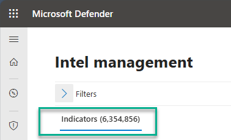
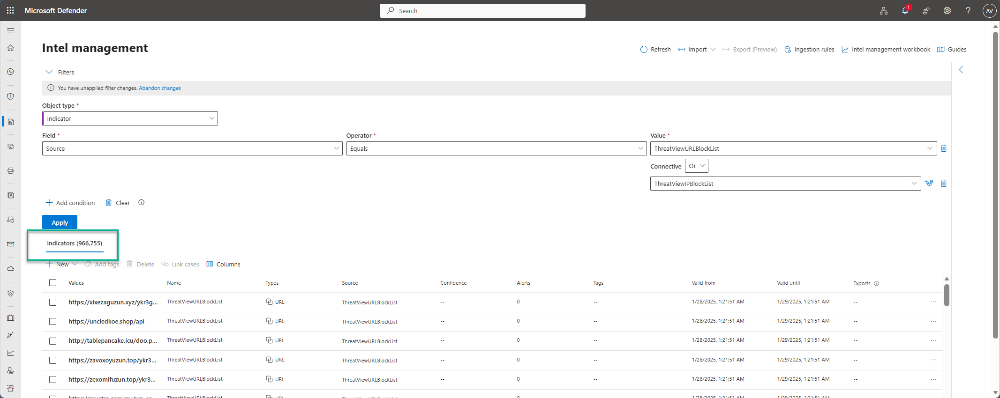
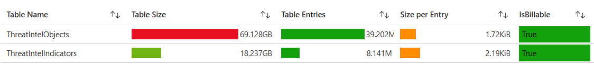
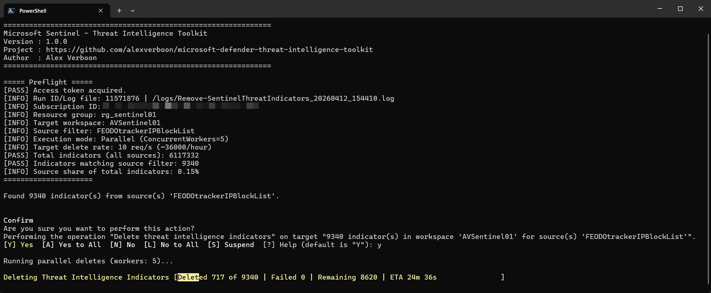

# Microsoft Defender Threat Intelligence Toolkit

[](LICENSE)


A community PowerShell toolkit for managing **Microsoft Sentinel Threat Intelligence indicators**.

---

## Overview

The toolkit was developed to support Security Operations Teams and security engineers in managing threat intelligence (TI) indicators, including bulk deletion from a Microsoft Sentinel workspace.

## Threat Intelligence in Microsoft Sentinel

Threat intelligence describes information about existing or potential threats, including both high-level insights (such as threat actors and techniques) and low-level indicators like IP addresses, domains, URLs, and file hashes.
In Microsoft Sentinel, the most commonly used form is threat indicators (IoCs), which link observed artifacts to known malicious activity and are used to detect threats and enrich investigations.

### Ingesting Threat Intelligence

Microsoft Sentinel provides multiple supported methods to ingest and manage threat intelligence:

- **Data connectors**  
  Import intelligence from external platforms and feeds, including Microsoft Defender Threat Intelligence and STIX/TAXII sources  
- **Upload API**  
  Send curated threat intelligence (STIX objects) directly from custom applications or TIP solutions via REST API  
- **TAXII connector (STIX/TAXII standard)**  
  Use the built-in TAXII client to ingest intelligence from industry-standard feeds  
- **Threat Intelligence Platform connector (legacy)**  
  API-based ingestion limited to indicators, currently being deprecated in favor of the upload API  

These ingestion options allow organizations to centralize threat intelligence in the workspace, where it can be stored, managed, and used for detection, hunting, and analysis.

For more details see: [Threat intelligence in Microsoft Sentinel](https://learn.microsoft.com/en-us/azure/sentinel/understand-threat-intelligence)

### The problem: indicator bloat

Over time, a Microsoft Sentinel workspace can accumulate a large number of threat intelligence indicators (IoCs). 
While indicators are typically expected to expire automatically, this may not always be consistently enforced in practice. A common root cause is missing expiration dates on IOCs, often originating from testing activities. 
As a result, outdated or irrelevant indicators remain in the workspace while new ones continue to be added, leading to a steady increase in the overall number of IoCs.

The screenshot below shows an example workspace with over **6.3 million indicators**:



At this scale, indicator management through the portal becomes impractical. Searches are slow, filtering is cumbersome, and there is no built-in bulk delete capability for large volumes.

### Identifying the source

To understand which feeds are responsible for the high volume, use the **Source** filter in the Microsoft Defender portal under **Intel management**. Filtering by source lets you quickly see how many indicators each feed has contributed:



In the example above, filtering by `ThreatViewURLBlockList` and `ThreatViewIPBlockList` reveals nearly **967,000 indicators** from those two sources alone. Once you know the source name, you have everything needed to target a bulk delete.

### Impact on Log Analytics costs

A high indicator count does not only affect portal usability, it also directly drives up the size of the `ThreatIntelIndicators` and `ThreatIntelObjects` tables in Log Analytics, which contributes to ingestion and retention costs.

The screenshot below (from the Microsoft Sentinel workspace usage workbook) shows how the TI-related tables contribute to overall data volume:



To quantify the cost contribution per feed source, run the following KQL query in your Log Analytics workspace:

```kql
ThreatIntelIndicators
| where TimeGenerated > ago(360d)
| where _IsBillable == true
| summarize 
    TotalVolumeGBLog = round(sum(_BilledSize / 1024 / 1024 / 1024), 2),
    Count = count() 
    by SourceSystem
    //| summarize round((sum(TotalVolumeGBLog)),2)
```

This returns the billed volume in GB and indicator count broken down by source — making it straightforward to identify which feeds are the largest cost contributors and prioritise which ones to clean up first.

### Cleaning up with this script

With the source name identified, set `$SourceFilter` in `Invoke-RemoveSentinelThreatIndicator.ps1` to one or more source values and run the script. The script then counts all matching indicators, prompts for confirmation, and deletes in batches while handling pagination, token refresh, and rate limiting automatically.

> [!NOTE]  
> - **Scope limited to ThreatIntelIndicators**  
>   The current script only supports removal of indicators from the `ThreatIntelIndicators` table.  
>   Management of `ThreatIntelObjects` requires the newer [Microsoft Graph Security Threat Intelligence API](https://learn.microsoft.com/en-us/graph/api/resources/security-threatintelligence-overview?view=graph-rest-1.0), which is not covered here since I currently do not have the required license to access this API.  
>
> - **Source-based deletion only**  
>  The script removes all indicators associated with the specified `Source`.  
>  More granular filtering (for example based on IoC properties such as type, confidence, or expiration) is not currently supported, but is planned for a future version of the toolkit.

The screenshot below shows the indicator delete progress view used during bulk cleanup runs:



---

## Scripts

| Script | Description |
|--------|-------------|
| `Scripts\Common\Toolkit.Logging.ps1` | Shared logging helpers (`Initialize-ToolkitLogger`, `Write-Log`) for reuse across scripts. |
| `Scripts\Remove-SentinelThreatIndicators.ps1` | Contains the `Remove-SentinelThreatIndicators` function. Uses a count-and-drain workflow designed for large datasets, with strict preflight count checks, rate/backoff controls, and end-of-run reconciliation. Full workflow and operational details: [docs/remove-sentinel-threat-indicators.md](docs/remove-sentinel-threat-indicators.md). |
| `Scripts\Invoke-RemoveSentinelThreatIndicator.ps1` | Execution script used to run indicator deletion. Edit the configuration parameters at the top first, then run this file. |

---

## Prerequisites

| Requirement | Details |
|-------------|---------|
| PowerShell | 7.0 or later (required). |
| Az.Accounts module | `Install-Module Az.Accounts` |
| Azure RBAC | **Microsoft Sentinel Contributor** (or equivalent) on the target workspace. |

---

## Quick Start

1. **Get the repository locally** (recommended):

    ```powershell
    git clone https://github.com/alexverboon/microsoft-defender-threat-intelligence-toolkit.git
    cd microsoft-defender-threat-intelligence-toolkit
    ```

    If you prefer, you can also download the repository ZIP from GitHub and extract it.

2. **Install the required module** (if not already installed):

   ```powershell
   Install-Module Az.Accounts -Scope CurrentUser
   ```

3. **Sign in to Azure:**

   ```powershell
   Connect-AzAccount
   ```

### Bulk Indicator Removal

1. **Edit the configuration** in `Invoke-RemoveSentinelThreatIndicator.ps1`:

   Rate conversion reference: `req/hour = req/s * 3600` (examples: `1.0 -> 3600/hour`, `10.0 -> 36000/hour`).

   ```powershell
    $SubscriptionId    = "<subscription-guid>"       # Required: Azure subscription GUID containing the Sentinel workspace
    $ResourceGroupName = "<resource-group-name>"     # Required: Azure resource group name containing the workspace
    $WorkspaceName     = "<workspace-name>"          # Required: Log Analytics workspace name linked to Sentinel
    $BatchSize         = 100                         # Number of indicators to delete in each batch 
      $SourceFilter      = @("<source-name>")          # Required for safety; one or more sources, e.g. @("ThreatViewIPBlockList","ThreatViewURLBlockList"). Empty/missing values abort the run.
    $ConcurrentWorkers = 5                           # Max concurrent DELETE workers; sustained rate is controlled separately by TargetDeleteRatePerSecond
    $TargetDeleteRatePerSecond = 10.0                # Sustained DELETE rate across all workers. Start with 1.0 req/s as a safe baseline (~3600/hour).         Higher values (for example 10.0 req/s) can speed up overall processing but increase the chance of throttling (HTTP 429), depending on tenant and subscription limits.
    $ShowAPIWarnings = $false                        # When set, writes per-request 401/429 throttle diagnostics to the console. By default these messages are suppressed.
    $Confirm           = $true                       # $true = confirmation prompt; set $false for unattended runs
    $WhatIf            = $false                      # $true = simulate without deleting indicators
    $LogFile           = ""                          # Optional full file path; leave "" for default (script folder\Logs)
   ```

2. **Run the caller script:**

   ```powershell
    .\Scripts\Invoke-RemoveSentinelThreatIndicator.ps1
   ```

Operator note: `ConcurrentWorkers=1` runs sequentially, and values greater than `1` run parallel deletes. In both modes, sustained throughput is globally rate-limited by `TargetDeleteRatePerSecond`.

---

## Logging

The toolkit writes structured logfmt output for each run. Logs include run-level correlation (`run_id`), event names, progress, and warning/error context.

- Format reference: https://brandur.org/logfmt
- Default location for the current cleanup script: `<script folder>\Logs\Remove-SentinelThreatIndicators_<yyyyMMdd_HHmmss>.log`
- Full logging reference: [docs/logging.md](docs/logging.md)

## Used APIs

The toolkit currently uses the following Microsoft Sentinel / SecurityInsights REST APIs:

| Operation | Purpose | API version used | Microsoft Learn reference |
|---------|---------|------------------|---------------------------|
| Count | Exact pre-delete count and periodic remaining-count refresh | `2025-07-01-preview` | `Threat Intelligence Indicator Count API` - https://learn.microsoft.com/en-us/rest/api/securityinsights/threat-intelligence-indicator/count?view=rest-securityinsights-2025-07-01-preview&tabs=HTTP |
| Query | Fetch matching indicators in pages before deletion | `2025-09-01` | `Threat Intelligence Indicator Query API` - https://learn.microsoft.com/en-us/rest/api/securityinsights/threat-intelligence-indicator/query-indicators?view=rest-securityinsights-2025-09-01&tabs=HTTP |
| Delete | Delete individual indicators | `2025-09-01` | `Threat Intelligence Indicator Delete API` - https://learn.microsoft.com/en-us/rest/api/securityinsights/threat-intelligence-indicator/delete?view=rest-securityinsights-2025-09-01&tabs=HTTP |

**Not currently used:** The [Microsoft Graph Security Threat Intelligence API](https://learn.microsoft.com/en-us/graph/api/resources/security-threatintelligence-overview?view=graph-rest-1.0) is not used by this toolkit at this time, but will be considered for future updates.

## License

See [LICENSE](LICENSE).
